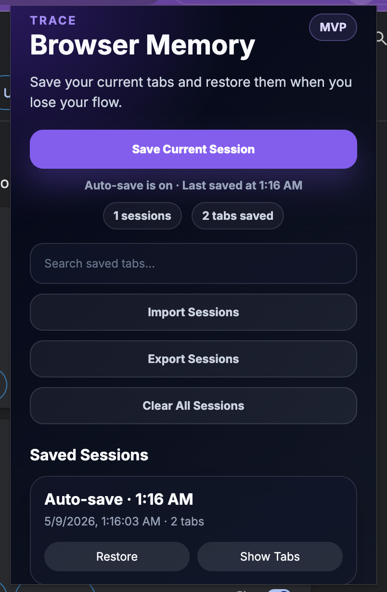

# Trace Browser Memory

Trace is a Chrome extension that saves, searches, restores, and organizes browser sessions so users can recover lost tabs and workflows.

## Preview

## Features

- Save current browser sessions
- Background auto-save with duplicate prevention
- Restore sessions in a new window
- Search saved tabs, URLs, tags, and summaries
- Pin favorite sessions
- Tag sessions by category
- Rename saved sessions
- Edit session summaries
- Copy session links
- Import/export saved sessions as JSON
- Collapsible tab lists
- Clean Chrome extension popup UI

## Tech Stack

- React
- TypeScript
- Vite
- Chrome Extension APIs
- Chrome Storage API
- Chrome Alarms API
- CSS

## Project Status

MVP in active development.

## Roadmap

- AI-generated session summaries
- Semantic search
- Cloud sync
- User accounts
- Stripe subscription billing
- Chrome Web Store release